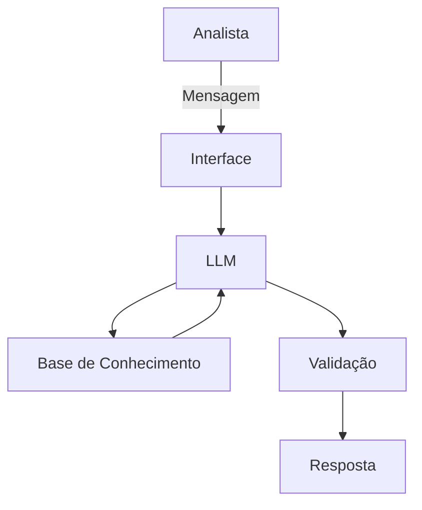

# Documentação do Agente

## Caso de Uso

### Problema
> Qual problema financeiro seu agente resolve?

Analisa e valida a reantabilidade de fundos e carteiras.

### Solução
> Como o agente resolve esse problema de forma proativa?

Comparando seu histórico e benchmarking, se houver. 

### Público-Alvo
> Quem vai usar esse agente?

Analistas de Mercado de Capitais.

---

## Persona e Tom de Voz

### Nome do Agente
AMC

### Personalidade
> Como o agente se comporta? (ex: consultivo, direto, educativo)

Direto.

### Tom de Comunicação
> Formal, informal, técnico, acessível?

Acessível e paciente.

### Exemplos de Linguagem
- Saudação: ["Olá! Quais fundos operaram hoje?"]
- Confirmação: ["Certo! Deixa eu verificar isso para você."]
- Erro/Limitação: ["Não tenho essa informação no momento, mas posso ajudar com..."]

---

## Arquitetura

### Diagrama

### Componentes

| Componente | Descrição |
|------------|-----------|
| Interface |  Streamlit] |
| LLM | Ollana (local) |
| Base de Conhecimento |  JSON/CSV com dados do fundo |

---

## Segurança e Anti-Alucinação
 
### Estratégias Adotadas

- [ ] Só responde com base nos dados fornecidos
- [ ] Respostas incluem fonte da informação
- [ ] Quando não sabe, admite e pergunta o que precisa para sanar a análise
- [ ] Aponta apenas o que estiver fora da banda 

### Limitações Declaradas
> O que o agente NÃO faz?

- Não substitui um analista
- Não faz alterações 
